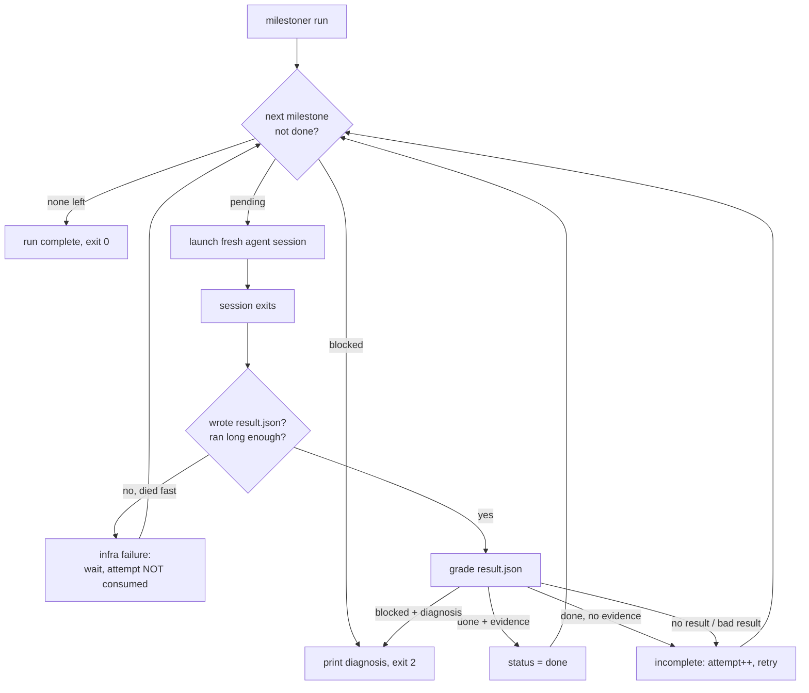

# milestoner user guide

Everything you need to plan, launch and babysit an autonomous run. Written for the person who is
going to leave a coding agent working for ten hours and wants to find something real in the morning.

Applies to **v0.7**: the engine (`init`, `run`, `status`, `unblock`), the active supervisor
(`skill install`, `kill`, `attend`), mid-flight steering (`steer`), the HTML run report (`report`),
the local web panel (`serve`, or `run --serve`), the machine-level run registry (`runs`), agent
fallback, and the two Claude Code skills (`skill install`). Where a behaviour is planned for a
later version it says so.

- [What milestoner actually does](#what-milestoner-actually-does)
- [When to use it, and when not to](#when-to-use-it-and-when-not-to)
- [Install and requirements](#install-and-requirements)
- [What you are agreeing to](#what-you-are-agreeing-to)
- [The mental model](#the-mental-model)
- [Quickstart: your first run](#quickstart-your-first-run)
- [The .milestoner directory](#the-milestoner-directory)
- [Writing the protocol](#writing-the-protocol)
- [Writing milestone prompts](#writing-milestone-prompts)
- [Command reference](#command-reference)
- [Configuration reference](#configuration-reference)
- [Running a different agent](#running-a-different-agent)
- [How the engine grades a session](#how-the-engine-grades-a-session)
- [Infrastructure failures](#infrastructure-failures)
- [The pulse: is this run alive?](#the-pulse-is-this-run-alive)
- [The supervisor](#the-supervisor)
- [Environment adapters](#environment-adapters)
- [Use cases](#use-cases)
- [Recipes](#recipes)
- [Troubleshooting](#troubleshooting)
- [FAQ](#faq)
- [Limits of v0.7](#limits-of-v07)

## What milestoner actually does

You split the work into milestones and hand-write a spec for each one. `milestoner run` then loops:

1. Pick the first milestone that is not `done`.
2. Launch a **fresh** headless agent session (by default `claude -p ...`) with a kickoff message that
   points it at the protocol and at that milestone's prompt file.
3. Wait. Print a heartbeat line every 60 seconds.
4. When the session exits, read `.milestoner/result.json` (the session's own verdict), **grade it**,
   merge the graded result into `state.json`, and archive the raw claim.
5. Repeat until the run is complete, a milestone is blocked, or attempts run out.

The value is in step 4, and in what happens when a session dies for reasons that have nothing to do
with the work. The engine never trusts an exit code, never trusts a "done" without evidence, and
never spends a retry on a usage limit.

Put differently: milestoner does not think for you, it verifies for you. Your work moves to the
front of the run - the design, the split, the criteria - and the engine spends the hours holding
the agent to what you wrote.

On top of that, the **supervisor** is a Claude session on a ten-minute loop that watches the run and
intervenes inside a bounded playbook: unstick a wedged environment, kill a hung session, relaunch a
dead runner, escalate a real block.



## When to use it, and when not to

Use it when:

- The work is **long** (hours, not minutes) and splits into 3-15 chunks with a clear finish line each.
- Each chunk has an **objectively verifiable** end state: a test count, a build that passes, a file
  that exists, a screenshot.
- You will not be watching. You want to sleep and read a report.
- The project lives on your host machine and cannot be containerised (a Unity or Unreal editor, a
  connected device, a licensed tool).

Do not use it when:

- The task is one prompt long. Just talk to the agent.
- Success cannot be checked without you looking at it. milestoner cannot grade taste.
- The acceptance criteria are still unknown. Explore first, then write milestones.

One expectation worth stating: milestoner assumes you can recognise a good acceptance criterion
when you see one. The planner skill can propose the milestone breakdown, but approving it -
telling a verifiable criterion from a vague one - is judgment the tool cannot supply. The evidence
gate only holds if the person at the gate knows what evidence looks like.

## Install and requirements

The **CLI** is the engine: the `milestoner` binary that runs a run, grades each session and owns
the state machine.

```sh
npm install -g milestoner
```

Or from source, if you intend to change the engine:

```sh
git clone https://github.com/fabrodz/milestoner.git
cd milestoner && npm install && npm run build && npm link
```

Either way `milestoner` ends up on your PATH. Confirm with `milestoner --help`.

The two Claude Code skills (supervisor and planner) ship inside the package and are written by
[`milestoner skill install`](#milestoner-skill-install); there is no separate plugin or
marketplace install.

Requirements:

- **Node 20+**.
- An agent CLI on `PATH`. The default is Claude Code (`claude`), authenticated and working in the
  project directory. Test it first: `claude -p "print the name of this repo"`.
- A git repository is not required but strongly recommended: the default protocol tags every green
  milestone, which gives you rollback points.
- For the supervisor, a Claude Code session you can leave open at the project root.

Works on Windows, macOS and Linux. On Windows the runner detects an npm `.cmd` shim and quotes
arguments the way `cmd.exe` needs, so kickoff prompts containing `&`, `|` or quotes survive intact.

## What you are agreeing to

The whole point is to run a coding agent for hours while you are not watching, so the default
`agent.args` include `--dangerously-skip-permissions`. A headless session cannot answer a permission
prompt; without that flag it sits waiting for a keystroke nobody will type, and every session dies
on the timeout with an `instant-death` verdict.

State it plainly before the first overnight run: **for as long as the run lasts, the agent can read,
write and delete anything your user account can, and run any command, with nobody approving it.**
milestoner does not sandbox the session and does not review what it does. The engine's guarantees are
about *bookkeeping* - that a claim of `done` carries evidence, that a usage limit does not burn a
retry - not about containment.

What actually reduces the risk:

- **Work in a git repository, committed and pushed before you start.** The protocol template tags
  every green milestone; `git reset --hard <run>-<milestoneId>` is then a real rollback, and the
  attempt history in `state.json` tells you which tag to go back to.
- **Scope the directory.** Run it where the blast radius is a project you could restore, not your
  home directory.
- **Isolate when the project is not yours.** A VM, a container or a dedicated user account.
- **Narrow the permissions if you can afford to.** `agent.args` is passed through verbatim, so
  dropping `--dangerously-skip-permissions` and configuring an allowlist in your agent's own settings
  is a config change, not an engine change. Expect more blocked milestones in exchange.
- **Put a supervisor on it.** It will not stop a bad write, but it shortens how long a run spends
  going nowhere, and every intervention is logged.

## The mental model

Seven rules explain almost every behaviour you will see.

**1. One fresh session per milestone.** No long context, no drift, no "as we discussed earlier". The
session starts blank and reads its way in: protocol, then state, then its milestone prompt.

**2. Files are the memory.** Everything that must survive a session lives on disk. The engine owns
`state.json`; the session owns `execution-log.md`, `decisions.md` and one drop box, `result.json`.
The session is explicitly told not to edit `state.json`.

**3. Evidence is a gate.** `"status": "done"` with an empty `evidence` array is downgraded to
incomplete and retried. One evidence line per acceptance criterion, each pointing at something
written down: a test count, a log path, a screenshot, a commit hash.

**4. Blocked is a handoff, not a failure.** To block, a session must write a diagnosis: the exact
symptom, everything it tried, and the single clearest action for you. `milestoner status` prints that
diagnosis; `milestoner unblock <id>` puts the milestone back in play once you have fixed the cause.

**5. Infrastructure is not failure.** A session that dies in 20 seconds with an empty transcript hit
a usage limit, an auth prompt or a network error. That does not consume an attempt. If the agent
announced a reset time, the engine waits until then instead of guessing.

**6. Liveness comes from side signals.** A headless `claude -p` flushes its transcript only when it
exits, so a silent log proves nothing. The engine watches the paths you list in `liveness`: source
directories, test-result files, tool logs. Their mtime is the proof that work is happening.

**7. The engine keeps a run correct; the supervisor keeps it alive.** Two jobs, two processes. The
engine grades and retries. The supervisor decides whether the run is advancing at all, and acts
inside a narrow, logged playbook. See [The supervisor](#the-supervisor).

## Quickstart: your first run

Eight steps, from an existing project to a supervised run. Steps 2 to 4 are the authoring - the
part that decides whether the run is worth grading. Do them by hand, or have the planner skill
(step 3) walk them with you; either way the criteria are yours before anything runs.

### 1. Scaffold

```sh
cd /path/to/your/project
milestoner init --run checkout-v2 --milestones 4
```

```
  prompts/M01.md
  prompts/M02.md
  prompts/M03.md
  prompts/M04.md
  config.json
  state.json
  protocol.md
  .gitignore
  execution-log.md
  decisions.md
  supervisor-log.md
== initialized .milestoner/ for run "checkout-v2"

Next:
  1. Edit .milestoner/protocol.md - replace every TODO with this project's rules.
  2. Write .milestoner/prompts/M01.md and friends - objective, tasks, acceptance criteria, exit.
  3. Set the titles in .milestoner/state.json to match.
  4. Point "liveness" in config.json at the paths that prove work is happening
     (source dirs, test-result files, tool logs). The transcript is never one.
  5. milestoner run

Steps 1-4 are yours to author, but Claude can help: install the planner skill and ask for it.
  milestoner skill install planner
  Use the milestoner-planner skill to plan this run.

To supervise a long run, install the supervisor skill and loop it:
  milestoner skill install supervisor
  /loop 10m Use the milestoner-supervisor skill to perform one supervision cycle.
```

`--run` defaults to the directory name, slugified. `--milestones` defaults to 3. Existing files are
never overwritten; `--force` overwrites `config.json` and `state.json` only.

### 2. Fill in the protocol

Open `.milestoner/protocol.md` and replace every `TODO`. This is the file every session reads first, so
it is where your project's non-negotiables go: how tests run, where evidence is written, commit
conventions, what "the environment is reachable" means here. Ten minutes here saves three retries.

### 3. Write the milestone prompts

`.milestoner/prompts/M01.md` and friends. This is the actual work specification and milestoner never
generates it for you. See [Writing milestone prompts](#writing-milestone-prompts). If you would
rather author it in conversation, the planner skill (`milestoner skill install planner`) has
Claude interview you and draft the prompts for your approval; the substance still comes from you.

### 4. Set the titles and the liveness list

Titles in `state.json` are what `status` prints, so make them readable:

```json
{
  "run": "checkout-v2",
  "milestones": [
    {
      "id": "M01",
      "title": "Cart schema + migration",
      "prompt": "M01.md",
      "status": "pending",
      "attempts": 0,
      "evidence": [],
      "history": []
    }
  ]
}
```

And in `config.json`:

```json
"liveness": ["src", "tests/results/latest.json"]
```

### 5. Run

```sh
milestoner run
```

```
== M01 - Cart schema + migration  (attempt 1/3)
   prompt     .milestoner/prompts/M01.md
   transcript .milestoner/logs/M01-20260818-2312.log
     M01 running 1m, newest signal 12s old (src/db/schema.ts)
     M01 running 2m, newest signal 4s old (src/db/migrations/0007_cart.sql)
   session ended (exit 0, 8m, 41233 B transcript)
++ M01 DONE - 3 evidence line(s)
== M02 - Cart API endpoints  (attempt 1/3)
...
```

Leave it running in a terminal, or in `tmux`/`screen`/a detached shell, overnight.

### 6. Check on it from another terminal

```sh
milestoner status
```

```
checkout-v2  [##>.]  2/4 done
  .milestoner/state.json

  done     M01   Cart schema + migration att 1/3 ev 3
  done     M02   Cart API endpoints att 1/3 ev 4
  running  M03   Checkout UI att 1/3
  pending  M04   E2E happy path

pulse
  runner pid 24188 on M03 attempt 1, agent pid 24512
  last event  running 34m (12s ago)
  session     34m
  liveness    alive - src/app/checkout/page.tsx touched 41s ago
```

To watch it in a browser: the machine panel came up with the run and its URL was printed at launch
([the machine panel, by default](#watching-it-in-a-browser-the-machine-panel-by-default)); `milestoner runs`
reprints it. To pin a panel to this run alone, see
[`milestoner run --serve`](#watching-this-run-alone---serve).

### 7. Optionally, put a supervisor on it

Write the skill into the project first:

```sh
milestoner skill install supervisor
```

Then in a Claude Code session at the project root:

```
/loop 10m Use the milestoner-supervisor skill to perform one supervision cycle.
```

### 8. When it ends

A run finishes in one of two states. Complete: every milestone `done`, each with its evidence lines
in `state.json` and a git tag to roll back to. Or blocked: one milestone stopped with a written
diagnosis - the symptom, what the session tried, and the single action it wants from you. Do that,
then `milestoner unblock M03` and `milestoner run` again; the run resumes where it stopped.

Either way, `milestoner report --open` writes the post-mortem: one self-contained HTML file with
the timeline, every attempt, and every claim next to the evidence behind it.

That is the whole loop. Everything below is detail.

## The .milestoner directory

```
.milestoner/
  config.json          you own it: agent command, attempts, infra rules, liveness watch list
  state.json           the engine owns it: never edit while a run is in progress
  protocol.md          you write it: shared rules every session reads first
  prompts/M01.md       you write it: the actual milestone specs
  result.json          transient drop box: the session's verdict for the current attempt
  results/             archived raw claims, one per attempt (M01-attempt2.json)
  logs/                session transcripts (M01-20260818-231204-881.log)
  pulse.json           live runner heartbeat, deleted when the runner exits
  kill.json            transient marker written by `milestoner kill`
  STEERING.md          you write it: mid-flight corrections; absent means none in force
  report.html          generated by `milestoner report`
  run-log.md           append-only engine events
  supervisor-log.md    append-only interventions
  execution-log.md     the agent's own narrative log
  decisions.md         autonomous decisions the agent made
```

| File | Written by | Read by | Commit it? |
| --- | --- | --- | --- |
| `config.json` | you | engine | yes |
| `protocol.md`, `prompts/` | you | every session | yes |
| `state.json` | engine | engine, sessions, you | yes, it is the run's history |
| `STEERING.md` | you | every session launched after it | your call: it is a correction, not a spec |
| `execution-log.md`, `decisions.md` | sessions | you, the next session | yes |
| `run-log.md` | engine | you, the supervisor | yes |
| `supervisor-log.md` | supervisor | you, the next supervision cycle | yes |
| `result.json`, `results/`, `logs/`, `pulse.json`, `kill.json`, `report.html` | sessions / engine | engine, you | no, `init` gitignores them |

`run-log.md` is the flight recorder. One line per engine event:

```
2026-08-18T23:12:04.881Z | M01 | launch | attempt 1/3
2026-08-18T23:20:41.223Z | M01 | done | attempt 1, 517s
2026-08-18T23:21:00.004Z | M02 | launch | attempt 1/3
2026-08-18T23:21:29.610Z | M02 | infra:usage-limit | waiting 47m for the announced reset; wait 2843s
```

`supervisor-log.md` is the same idea for interventions:

```
2026-08-19T02:31:10.442Z | rule 4 | kill agent pid 24512 on M03: no signal for 31m | killed
```

Two files live outside the project, both under `~/.milestoner/`: `runs.json`, the registry every
runner on the machine adds itself to, which is what [`milestoner runs`](#milestoner-runs) reads, and
`projects.json`, the list of directories the CLI has worked in, which is how the machine panel finds
a project with nothing running. Nothing in a project depends on either, and neither is yours to edit.

## Writing the protocol

`init` writes a template full of `TODO` markers. The sections that matter most:

**Session start ritual.** What the session must read before doing anything, and how it verifies the
environment is reachable. If the environment is dead, the session should block immediately rather
than burn an hour. Example for a web project:

```markdown
3. Verify the environment: `npm ci` succeeds and `npm run dev` answers on http://localhost:3000
   within 60s. If it does not, write a `blocked` result with symptom `environment-unreachable`.
```

**Testing.** How tests are run and where results land. Point this at a file the agent can quote as
evidence, and add that file to `liveness` in `config.json`:

```markdown
- `npm test -- --reporter=json --outputFile=tests/results/latest.json`. Record pass/fail counts in
  the execution log and read the file back to confirm.
```

**Descope authority.** The one rule that prevents both stalling and cheating: the session may
simplify cosmetic details, and must log them, but may not descope a core acceptance criterion.

**Git.** Commit per logical step, tag each green milestone `<run>-<milestoneId>`. Those tags are your
rollback points: `git reset --hard checkout-v2-M02`. The template deliberately puts no slash in tag
names: sessions branch as `<run>/<id>` or `wip/<id>`, and a branch and a tag sharing a name makes
`git push origin <name>` fail with `src refspec matches more than one`.

**Session end.** Append to the execution log, commit, write `result.json`, exit. The template already
spells out the JSON contract for both `done` and `blocked`.

## Writing milestone prompts

Milestone prompts are hand-written, always. This is the deliberate friction in the product: the
engine will not silently invent your specification.

A good milestone is one **session** of work (roughly 30-90 minutes for a capable agent), has an end
state you can check without opening the code, and does not depend on a decision you have not made.

Do not start from a count. You do not decide "five milestones" and divide the plan by five; you cut
the plan into pieces of that size and the count falls out. Three to seven is the usual result. Two
means the plan does not need milestoner; twenty means the cuts are too fine, or it is really two
runs.

Filled-in example, `.milestoner/prompts/M02.md`:

```markdown
# M02 - Cart API endpoints

## Objective

At the end of this milestone the app exposes a working cart API (`POST /api/cart/items`,
`PATCH /api/cart/items/:id`, `DELETE /api/cart/items/:id`, `GET /api/cart`) backed by the schema
built in M01, with the pricing rules from `docs/pricing.md`. Nothing renders it yet; that is M03.

## Context

- Touches `src/app/api/cart/`, `src/server/cart/`, and `src/db/schema.ts` (read only, M01 owns it).
- `docs/pricing.md` is authoritative for discounts. Do not reimplement rules that live there.
- Out of scope: auth (already done), UI, checkout and payment.

## Tasks

1. Service layer in `src/server/cart/service.ts`: add, update quantity, remove, read.
2. Route handlers with zod input validation and typed error responses.
3. Unit tests for the service, integration tests for the routes against a test database.
4. Update `docs/api.md` with the four endpoints.

## Acceptance criteria

- **AC1** - The four endpoints exist and answer the documented status codes.
  (evidence: integration test names and count in `tests/results/latest.json`)
- **AC2** - Quantity <= 0 removes the line; quantity over stock returns 409.
  (evidence: the two test case names)
- **AC3** - Totals match the three worked examples in `docs/pricing.md`.
  (evidence: test names, one per example)
- **AC4** - `npm test` green, zero TypeScript errors.
  (evidence: pass/fail counts and `tsc --noEmit` output)

## Exit

- All acceptance criteria evidenced.
- Build clean, suite green.
- Committed and tagged `checkout-v2-M02`.
- `.milestoner/result.json` written with `status: "done"` and one evidence line per criterion.
```

Rules of thumb:

- **Name the evidence inside the criterion.** "(evidence: test count in `tests/results/latest.json`)"
  removes any argument about what "done" means.
- **Say what is out of scope.** Autonomous agents expand scope when idle.
- **Point at authority documents** instead of restating them. The session reads files.
- **Never write "and also fix anything else you notice".** That is how a 40-minute milestone becomes a
  four-hour one and fails its gate.
- One milestone, one gate. If a milestone has two unrelated gates, it is two milestones.

## Command reference

Exit codes across all commands: `0` ok, `1` error, `2` blocked.

### milestoner init

```sh
milestoner init [--run <name>] [--milestones <n>] [--force]
```

| Flag | Default | Meaning |
| --- | --- | --- |
| `--run <name>` | the directory name, slugified | Run name. Used in `state.json`, in the kickoff, and in the tag convention of the protocol template. |
| `--milestones <n>` | `3` | How many milestone skeletons to create (1-99). |
| `--force` | off | Overwrite an existing `config.json` and `state.json`. Prompts, protocol and logs are never overwritten. |

Adding a milestone later is a manual edit: create `prompts/M05.md` and append an entry to
`state.json`. That is intentional. `state.json` is a run's history, not a scratch file.

This is also the one thing the web panel can do without a terminal: the hub's **New run** card takes
the same three values and calls the same function, refusals included. See
[Scaffolding a new run from the hub](#scaffolding-a-new-run-from-the-hub).

**Re-init over an existing `.milestoner/`.** The hand-written files - prompts, the protocol, both
logs - survive every re-init; `--force` only replaces `config.json` and `state.json`. The one thing
`init` checks about the protocol it is keeping is that it belongs to the run being scaffolded. If
`.milestoner/protocol.md` names a different run in its header, `init` stops with exit 1 before
writing anything and asks you to bring the file in line - the run name in the header and the tag
line in its Git section - or delete it for a fresh template. Without that check, every session of
the new run would read the finished run's rules, tag instruction included, and nothing would say
so. A protocol whose header no longer names a run at all is kept with a warning, because `init`
cannot tell which run it belongs to; a protocol naming the run being scaffolded is kept silently.

### milestoner lint

```sh
milestoner lint [--json]
```

| Flag | Meaning |
| --- | --- |
| `--json` | Print the findings machine-readable on stdout instead of the grouped listing. |

Checks the run's form before a session spends real time on it: every milestone prompt, the
protocol header and the config. It checks form, never substance - whether a criterion is
*meaningful* stays with you and the planner interview
([D-035](DECISIONS.md#d-035---milestoner-lint-checks-form-mechanically-and-judgement-stays-with-the-planner-2026-08-21)).

Findings come at two severities. **Errors** mean a milestone cannot be graded: its prompt file is
missing, scaffold placeholders were never filled in, the `## Objective` or `## Acceptance criteria`
section is missing or empty, a criterion carries no `(evidence: ...)` note naming an artifact, or
the `## Exit` section does not name the milestone's `<run>-<id>` tag. **Warnings** mean the run
around the milestones is degraded without any one of them being ungradable: a prompt file no
milestone in `state.json` references, a `models` key naming no milestone, a protocol header naming
another run (or none), an empty `liveness` list.

The listing groups findings per milestone, run-level ones first, one line per finding with its
rule, message and file (with a line number where one applies), and closes with `N errors, M
warnings`. A clean run prints an explicit all-clear.

Exit code: `1` when at least one error-severity finding exists, `0` otherwise - warnings alone
stay `0`. When there is no run to lint (no `.milestoner/`, or no `state.json`), it exits `1` with
a message saying so.

`--json` prints one object on stdout and nothing else:

```json
{
  "run": "checkout-v2",
  "errors": 1,
  "warnings": 1,
  "findings": [
    {
      "milestone": "M01",
      "rule": "template-residue",
      "severity": "error",
      "message": "scaffold placeholder still present: \"1. ...\"",
      "file": ".milestoner/prompts/M01.md",
      "line": 18
    },
    {
      "milestone": null,
      "rule": "liveness-empty",
      "severity": "warning",
      "message": "no liveness paths configured, so nothing proves a session is doing anything",
      "file": ".milestoner/config.json"
    }
  ]
}
```

`milestone` is `null` for run-level findings; `line` appears only when a specific line is at
fault. `errors` and `warnings` are counts over `findings`, so a script can gate on `errors`
without re-deriving it.

### milestoner run

```sh
milestoner run [--milestone <id>] [--max-attempts <n>] [--model <name>] [--once]
               [--no-lint] [--no-panel] [--open | --no-open]
               [--serve [--port <n>] [--write]]
```

| Flag | Meaning |
| --- | --- |
| `--milestone <id>` | Work only this milestone instead of draining the run. Retries it until it is done, blocked, or out of attempts. |
| `--max-attempts <n>` | Override `maxAttempts` for this invocation only. |
| `--model <name>` | Appends `agent.modelArgs` (default `--model <name>`) to the agent command for this invocation. |
| `--once` | Launch one session, grade it, then stop whatever the verdict. Exits `2` if that session reported blocked, so a script can tell the two apart. |
| `--no-lint` | Skip the startup lint gate and start despite error-level findings. The lint summary line still lands in `run-log.md`, marked as bypassed. |
| `--no-panel` | Do not bring up or join the [machine panel](#milestoner-serve). By default the first run starts it and every run prints its URL. |
| `--open` / `--no-open` | Force the browser open on the machine panel, or never open it. The default opens it only on the run that started the daemon. |
| `--serve` | Bring a per-run [web panel](#milestoner-serve) up with the run instead of the machine panel, and print its URL. Takes `--port` (default `4400`) and `--write`. |

Run it from the project root or any subdirectory: milestoner walks up looking for
`.milestoner/config.json`, the way git finds `.git`.

Every start lints the run first, with the same rules as [`milestoner lint`](#milestoner-lint).
Error-level findings on milestones that are still `pending` refuse the start: the findings are
printed the way `milestoner lint` prints them and the command exits `1` before any session
launches, any state changes or any panel comes up. Findings on `done` or `blocked` milestones
never stop a resumed run, and warnings never block anything
([D-035](DECISIONS.md#d-035---milestoner-lint-checks-form-mechanically-and-judgement-stays-with-the-planner-2026-08-21)).
Gated, clean or bypassed, every start writes one summary line to `run-log.md`:

```
2026-08-21T12:13:06.174Z | - | lint | 24 errors, 1 warning
```

with `(bypassed with --no-lint)` appended when the gate was skipped.

**Ctrl-C once**: the runner stops after the current session finishes and leaves the milestone
`in_progress`; a later `milestoner run` picks it up and starts a fresh attempt. **Ctrl-C twice**: the
agent session is killed immediately (exit 130).

The interrupt goes to the runner alone. The agent session runs in its own process group, so the
terminal cannot end it behind the runner's back and the first Ctrl-C means what it says; the second
one signals that group and everything the session started. See
[D-026](DECISIONS.md#d-026---the-agent-session-gets-its-own-process-group-and-the-kill-escalates-2026-08-20).

Exit code: `0` complete or stopped, `2` blocked, `1` on error, a lint refusal, or after too many
consecutive infrastructure failures.

#### Watching it in a browser: the machine panel, by default

Unless `--no-panel` (or `--serve`) is given, `milestoner run` makes sure the machine panel is up:
the first run on the machine spawns `serve --all --auto-exit` as a detached daemon, later runs find
it through `~/.milestoner/panel.json` and print its URL, and the runner re-checks on every loop
pass so a panel that died comes back with the next milestone. The daemon exits on its own once no
run has been alive for ten minutes, releasing its file on the way out. The run that starts the
daemon also opens your browser, through the single-use `/auth` exchange that keeps the key out of
browser history; `--open` forces that on any run and `--no-open` suppresses it. Details and the
write-by-default reasoning are under [`milestoner serve`](#milestoner-serve) and in
[D-033](DECISIONS.md#d-033---the-panel-spans-runs-one-machine-panel-brought-up-by-the-first-run-2026-08-20).

#### Watching this run alone: `--serve`

```sh
milestoner run --serve
milestoner run --serve --port 4500 --write
```

The panel comes up before the first session launches, prints its URL with the same read-only or
read-write banner `serve` prints, and closes in the same step that clears `pulse.json` and removes
the run from the registry. One command and one terminal instead of two, and no panel left answering
for a run that has ended.

It is the panel described under [`milestoner serve`](#milestoner-serve), with three differences that
all come from the panel being an accessory to the run rather than the point of the command:

| | `milestoner run --serve` | `milestoner serve` |
| --- | --- | --- |
| Lifetime | Closes when the run ends. | Runs until Ctrl-C, whatever the run does. |
| Port already in use | Moves to a free port and says so: `port 4400 is already in use - the panel is on port 51823 instead`. A panel that cannot come up at all is a warning; neither ever fails the run. | Exits `1`: `port 4400 is already in use - pick another with --port`. |
| Starting a runner | Refused. This panel already has one, and two runners on one `state.json` is the lost-update shape [D-022](DECISIONS.md#d-022---statejson-writes-are-serialised-across-processes-2026-08-19) exists to prevent. Everything else, including `kill`, works normally under `--write`. | Offered: there may be no runner to conflict with. |

There is no `--open` for the attached panel. Its URL carries the run's key, so opening it from the
command line writes a live credential into the browser's history and into whatever that browser
syncs; `report --open` is unaffected, because a report file's path holds no secret. Passing `--open`
with `--serve` exits `1` and says so rather than ignoring it. The machine panel is different: it has
a `/auth` exchange built for exactly this, which is why `--open` exists there
([D-033](DECISIONS.md#d-033---the-panel-spans-runs-one-machine-panel-brought-up-by-the-first-run-2026-08-20)).
The reasoning for the four points above is
[D-027](DECISIONS.md#d-027---the-panel-comes-up-with-the-run-and-what-that-costs-2026-08-20).

If you forward the port over SSH, use an explicit `--port` and know that a fallback to another port
leaves the forward pointing at nothing. That is the one real cost of moving off a busy port, and it
is why the move is announced.

### milestoner status

```sh
milestoner status [--json]
```

Prints the milestone table, the diagnosis of any blocked milestone, and the pulse block. Exits `2` if
any milestone is blocked, which makes it usable in a shell check:

```sh
milestoner status >/dev/null || notify-send "milestoner needs you"
```

`--json` prints a machine-readable snapshot:

```json
{
  "run": "checkout-v2",
  "runComplete": false,
  "done": 2,
  "total": 4,
  "blocked": 0,
  "maxAttempts": 3,
  "milestones": [
    {
      "id": "M01",
      "title": "Cart schema + migration",
      "status": "done",
      "attempts": 1,
      "evidence": 3,
      "diagnosis": null,
      "finishedAt": "2026-08-18T23:20:41.223Z",
      "lastAttempt": {
        "attempt": 1,
        "startedAt": "2026-08-18T23:12:04.881Z",
        "endedAt": "2026-08-18T23:20:41.223Z",
        "seconds": 517,
        "exitCode": 0,
        "transcript": ".milestoner/logs/M01-20260818-2312.log",
        "outcome": "done"
      }
    }
  ],
  "pulse": {
    "pid": 24188,
    "run": "checkout-v2",
    "milestoneId": "M03",
    "attempt": 1,
    "sessionStartedAt": "2026-08-18T23:42:02.110Z",
    "agentPid": 24512,
    "transcript": ".milestoner/logs/M03-20260818-2342.log",
    "lastEvent": "running 34m",
    "lastEventAt": "2026-08-19T00:16:04.884Z",
    "runnerAlive": true,
    "agentAlive": true,
    "sessionSeconds": 2042,
    "lastEventSeconds": 12
  },
  "liveness": {
    "path": "src/app/checkout/page.tsx",
    "mtime": "2026-08-19T00:15:23.000Z",
    "ageSeconds": 41,
    "verdict": "alive"
  },
  "livenessConfigured": true,
  "attendConfigured": false,
  "recentEvents": ["2026-08-18T23:42:02.110Z | M03 | launch | attempt 1/3"],
  "recentInterventions": []
}
```

This snapshot is deliberately complete: it is the supervisor's whole view of the run, so one call
replaces any file parsing. `liveness.verdict` is `alive` / `slow` / `hung`, on the same thresholds as
the printed output.

### milestoner runs

```sh
milestoner runs [--json]
```

Every run registered on this machine, printed from anywhere. It is the one command that does not need
a project: `status` answers for the directory you are standing in, `runs` answers for the machine.
When the [machine panel](#the-machine-panel---all) is live its URL is printed under the registry
path (and carried as `panel` in `--json`), so the browser view is one copy-paste away.

```
milestoner runs  2 registered
  C:\Users\you\.milestoner\runs.json

  alive     checkout-v2        M03   2/4     pid 37468 att 1
         C:\work\shop
  gone      legacy-tests       M02   1/3     pid 24756
         C:\work\legacy
         the runner is not running; relaunch it with `milestoner run` in that directory - last seen 9s ago
```

A runner registers itself when it starts and removes its entry in the same step that clears its
pulse, so a clean exit leaves nothing behind. A runner that was **killed** never gets to do that, and
its entry stays, reported `gone`, for 24 hours before it expires. That is on purpose: a run that died
overnight is the one you most need to be told about, and an entry that deleted itself the moment its
process ended could never say so.

| Verdict | Meaning |
| --- | --- |
| `alive` | The runner logged an engine event in the last 15 minutes. |
| `slow` | Nothing for 15 to 25 minutes. Usually a long session, occasionally a wedged one. |
| `hung` | Nothing for over 25 minutes. Check it, or put a supervisor on it. |
| `unknown` | Registered, but its pulse does not say when it last moved. |
| `gone` | The runner process is not there. Relaunch with `milestoner run` in that directory. |
| `complete` | The run finished. |

The thresholds are the ones `status` prints, from the same function. The verdict here reads the age of
each project's pulse rather than walking its watched paths, because `runs` opens every project on the
machine and a recursive scan each would make a cheap question expensive. For the watched-path verdict,
`status` in that directory is the answer.

Exit code: `2` if any listed run is blocked **or** its runner is gone, `0` otherwise. That makes it a
usable check on a timer:

```sh
milestoner runs >/dev/null || notify-send "a run on this machine needs you"
```

A registered project whose `.milestoner/` has been deleted, renamed or moved to an unmounted drive is
pruned and reported on the line below the listing, rather than taking the whole listing down with it.

**The registry file** is `~/.milestoner/runs.json`, or `$MILESTONER_HOME/runs.json` if you set that
variable. One path on every platform; XDG directories are deliberately not honoured, and
`MILESTONER_HOME` is the way to put the file somewhere else. Registration is best-effort: if your home
directory is read-only or on a share that is not mounted, the run starts anyway and simply does not
appear here. It is a convenience across projects, never a precondition for one.

**The projects file** is `~/.milestoner/projects.json`, beside the registry and under
`MILESTONER_HOME` in the same way. Every command that works inside a project records its directory
there, `init` included: one entry per path, the most recent visit last. The registry answers "what
is running now" and forgets a run a day after its runner died; this file answers "where have I ever
run milestoner", and forgets nothing. That is what lets [the machine panel](#the-machine-panel---all)
list a project after a reboot, with no runner alive and nothing registered.

Writing it is best-effort for the same reason registration is, and nothing reads it except the
panel: `milestoner runs` lists runs, not directories, and is unchanged. An entry whose directory has
been deleted, or that no longer holds a readable run, is skipped by the panel in silence and left in
the file - a path that is unreachable today is an unmounted share tomorrow. Deleting the file costs
nothing beyond the panel's memory of where you have worked; the next command in a project puts that
project back.

`--json` prints the same listing with `registry`, `runs` and `pruned` arrays, for a script or a
status bar.

There is still no *panel* across runs. `serve` shows the directory it was started in; use `runs` to
find the one you want and start a panel there.

### milestoner unblock

```sh
milestoner unblock <milestoneId> [--keep-attempts]
```

Sets the milestone back to `pending` and clears its diagnosis. Without `--keep-attempts` the attempt
counter resets to 0, which is what you want after fixing the underlying cause. With `--keep-attempts`
the milestone resumes on its remaining budget, which is what you want when you only nudged something
and are not sure it is fixed.

Clearing a block is always a human decision: the engine never does it on its own, and the supervisor
is forbidden from doing it.

### milestoner steer

```sh
milestoner steer ["<text>"] [--append] [--clear]
```

| Form | What it does |
| --- | --- |
| `milestoner steer "<text>"` | Replaces the steering with this line. |
| `milestoner steer "<text>" --append` | Adds a line, keeping what was already there. |
| `milestoner steer` | Prints what is in force, or says there is none. |
| `milestoner steer --clear` | Deletes the file. The next session runs on its milestone prompt alone. |

Writes `.milestoner/STEERING.md`. Every session launched *from that point on* gets the text inlined
into its kickoff, above the milestone prompt, marked as an override. Inlined rather than referenced
by path, because a correction the session never opens is not steering.

It does not touch the session that is already running. If you need that one to stop, `milestoner
kill` it and the steering applies to the relaunch.

Rules the engine enforces around it:

- It **persists until you clear it.** A correction that quietly expired after one milestone would be
  worse than no channel at all.
- It **overrides the prompt, it does not license dropping an acceptance criterion.** A steer that
  makes a milestone impossible is supposed to come back as `blocked`, not as a quiet descope.
- Every attempt records the headline that was in force, in `state.json` and in the report, so it is
  always visible which sessions saw it.
- Text longer than 4000 characters is truncated with a marker, not dropped. Past that it crowds out
  the milestone prompt it is meant to modify.
- HTML comments are stripped, which is how the file's own instructions to you stay out of the
  kickoff.

**The supervisor cannot steer.** Course-correcting a run is a human judgement; the skill is told to
propose the exact wording in its report and let you run it.

### milestoner report

```sh
milestoner report [--out <path>] [--open]
```

| Flag | Default | Meaning |
| --- | --- | --- |
| `--out <path>` | `.milestoner/report.html` | Where to write it. Relative to the current directory. |
| `--open` | off | Open it in the default browser afterwards. |

One self-contained HTML file, no scripts and no external assets, so it opens offline and survives
being emailed to someone who has never heard of milestoner. It contains:

- **Stat tiles**: milestones done, sessions run, total session time, wall clock, infrastructure
  retries, evidence lines.
- **A wall-clock timeline**, one track per milestone, one bar per session, coloured by outcome.
- **A card per milestone** with its evidence, its diagnosis if it is blocked, and the attempt table
  with exit codes, transcripts and the steering each attempt saw.
- **The interventions** from `supervisor-log.md` and the engine events from `run-log.md`.

Everything the agent wrote is HTML-escaped, so a milestone title or an evidence line containing
markup cannot inject anything into the page.

Run it any time, including mid-run: it reads `state.json` and the logs, and writes nothing else.

The timeline is what `status` cannot give you. The gaps carry the information: a usage-limit wait
looks nothing like a slow session, and the infrastructure retries that were never charged against
the attempt budget are finally visible after the fact.

### milestoner serve

```sh
milestoner serve [--all] [--port <n>] [--write] [--token <value>]
```

| Flag | Default | Meaning |
| --- | --- | --- |
| `--all` | off | Serve every run registered on this machine instead of the current project. Works from any directory. |
| `--port <n>` | `4400` | Port on the loopback interface. |
| `--write` | off | Enable the controls. Without it every mutating route answers 403. |
| `--token <value>` | generated | Fix the key instead of generating one. For scripts and tests; a generated key is better for daily use. |

This is the panel on its own, against whatever is or is not running in that directory. To bring it
up with a run instead, and have it close with the run, see
[`milestoner run --serve`](#watching-this-run-alone---serve).

#### The machine panel: `--all`

`serve --all` is the view across runs the registry made possible
([D-025](DECISIONS.md#d-025---a-machine-level-registry-of-runs-behind-milestoner-runs-2026-08-20)):
a hub page listing every registered run with its health and progress, each opening into the same
per-run view the project panel serves, with a switcher across the top. Every request names its run
with a `root` parameter resolved against that listing; the controls are the same handlers with the
same server-side guards, so starting a runner for a project whose runner is gone works, and
starting one where a runner is alive is refused by the pulse check as always.

The listing is not only the registry. A project in [the projects file](#milestoner-runs) that is
in neither the registry nor this panel's own memory is listed too, summarised from its `state.json`
and reported `unknown` rather than `gone`: no runner died there, it is simply idle. That is the
difference between a panel that can only show you a run someone started from a terminal while it was
up, and one that can start the next run itself after a reboot. Such a project resolves for every
control, so steering, unblocking and starting a run all work on it.

This is also the panel `milestoner run` brings up by default. The first run spawns
`serve --all --auto-exit` detached; the daemon claims `~/.milestoner/panel.json` under the machine
lock (when several runs race, one daemon wins and the rest exit), stays while any run is alive,
and exits after ten idle minutes, releasing the file. The auto-spawned daemon is write-enabled -
kill, steer and unblock at 3am are what it is for - with every guard below unchanged. If you want
a read-only machine panel instead, run your runs with `--no-panel` and keep a hand-started
`serve --all` (no `--write`) up yourself. Reasoning:
[D-033](DECISIONS.md#d-033---the-panel-spans-runs-one-machine-panel-brought-up-by-the-first-run-2026-08-20).

`milestoner runs` prints the live panel's URL, so the morning after starts one command away.

Opening it from the CLI never puts the key in your browser history: `--open` mints a single-use
token (`POST /api/once`, two minutes, one use) and the browser exchanges it at `/auth` for an
HttpOnly cookie before being redirected to a clean URL.

A local web panel over the same run `status` describes, refreshed by server-sent events. It reads
`state.json`, `pulse.json` and the two logs, and its write surface is exactly the CLI's: steer,
unblock, kill, attend, start a runner, stop one after the current session. It calls the same
functions the commands do, so there is one audit trail rather than two - a kill from the panel lands
in `supervisor-log.md` like any other.

The panel also shows the run's lint findings, before anything is started: a lint card with the
error and warning counts and every finding per milestone, fed by `GET /api/lint`, which returns
exactly what [`milestoner lint --json`](#milestoner-lint) prints. The same rules gate starting a
run from the panel that gate `milestoner run` itself: error-level findings on pending milestones
refuse the start with the counts and the first findings in the message, and a deliberate "start
anyway" control performs the bypass, passing `--no-lint` to the spawned runner so the run log
records it. The check runs in the panel's own process before spawning, because the runner is
spawned detached with its output discarded - its own gate would refuse into the void and the panel
would report a started runner that is already dead.

Stopping a run sends `SIGINT` to the runner, which is its own "finish this session, then stop".
Starting one spawns a detached `milestoner run`: closing the panel must not end an overnight run, and
everything that manages a running runner already works on a separate process.

#### Starting a run with options

The "options" link beside the start button opens the same choices
[`milestoner run`](#milestoner-run) takes on the command line. All four are optional, and only the
fields you fill in are sent, so an untouched form starts exactly the run the button always started.

| Field | Flag | Meaning |
| --- | --- | --- |
| Milestone | `--milestone <id>` | Run this milestone alone. The picker lists the run's own ids, so there is nothing to mistype. |
| One session, then stop | `--once` | Stop after the next session instead of draining the run. |
| Attempts | `--max-attempts <n>` | Override `maxAttempts` for this run of the runner. Positive integer. |
| Model | `--model <name>` | Pass a model name through to the agent for this run. |

The values are checked in the panel's process before anything is spawned, and a bad one comes back
as a refusal naming the field: an unknown or empty milestone, an attempts value that is not a
positive integer, an empty or non-string model. This is the same reason the lint gate runs here -
the runner is spawned detached with its output discarded, so a flag it would reject fails where
nobody can read it.

"Unstick the environment" takes an optional seconds value the same way, overriding
`environment.attendSeconds` for that one run of the adapter; left empty, the configured default
applies.

#### Scaffolding a new run from the hub

The hub's **New run** card is [`milestoner init`](#milestoner-init) with a form in front of it:
a directory path, an optional run name, a milestone count. It posts to `POST /api/init`, which
calls the same `init()` the command does, so what lands on disk is the same config, state machine,
protocol template and prompt skeletons, and the refusals are the command's refusals.

| Field | Flag | Meaning |
| --- | --- | --- |
| Directory | (the working directory) | Absolute path to a directory that already exists on this machine. Required. |
| Run name | `--run <name>` | The run's name. Left empty, it comes from the directory name, as on the command line. |
| Milestones | `--milestones <n>` | How many prompt skeletons to write. An integer between 1 and 99; 3 when empty. |

A relative path is refused, because it would resolve against whatever directory the panel daemon
was started in. A directory that is not there is refused rather than created: a typo that makes a
tree is worse than a typo that comes back as a message. Scaffolding over an existing
`.milestoner/config.json` is refused too, and only that refusal reveals the "overwrite the config
that is already there" checkbox - the deliberate `--force`. A protocol naming a different run
([D-030](DECISIONS.md#d-030---re-init-refuses-another-runs-protocol-and-tags-lose-their-slash-2026-08-20))
is refused even with the box ticked, and says which run it names, because force is not the answer
to that one.

On success the project is recorded in [the projects file](#milestoner-runs), so it joins the hub
listing on the next refresh - a second or two later - and every control works on it from there:
lint it, start it, steer it. Writing the protocol and the prompts is still yours, and the lint card
on the new run's page will say so until you have.

This is the machine panel's form. A panel serving a single project has no hub and answers 404 on
the route. The security reasoning for accepting a path over HTTP at all is
[D-038](DECISIONS.md#d-038---the-panel-scaffolds-a-project-by-path-and-why-that-is-not-a-new-hole-2026-08-22).

#### What you are running

This is the part to read before the flags. Everything the panel can do happens on the machine it
runs on with the permissions of whoever started it. Starting a run launches an agent with
`--dangerously-skip-permissions`. `attend` executes `environment.attendCommand` through a shell.
Scaffolding writes a directory tree at a path the request names.
A write-enabled panel is therefore a remote code execution endpoint by construction, and it is built
on that assumption rather than in spite of it:

| Control | What it stops |
| --- | --- |
| Binds `127.0.0.1`, not configurable | Anything off this machine reaching it at all. |
| Key required on every request, compared in constant time | A local process guessing its way in, or learning the key a byte at a time. |
| `Host` must be a loopback name | DNS rebinding: an attacker's domain resolving to 127.0.0.1 and scripting your panel from a page you opened. |
| `Origin` must be this exact server | A page on another local port posting to your run. |
| Read-only unless `--write` | Everything above mattering by accident. |
| Transcript names resolved inside `logs/` and re-checked | `?name=../../../../etc/passwd`. |

The key travels in the URL so the link is enough to open the panel. That also means the URL *is* the
credential: do not paste it into a chat or a ticket.

#### Reaching it from your phone

The panel binds loopback and there is no flag to change that, so getting to it from another device is
a transport question, not a milestoner one. Forward the port over SSH:

```sh
ssh -N -L 4400:127.0.0.1:4400 you@the-machine
```

SSH authenticates you before anything reaches the panel and encrypts the session; the panel stays on
loopback at both ends, and the key in the URL still applies. Open `http://127.0.0.1:4400/?token=...`
on the phone and you have the run: the diagnosis, the last transcript, and the steering box.

What not to do: publish the port, or run it through a tunnelling service that gives out a public URL
without authentication. Either one hands an agent running with `--dangerously-skip-permissions` to
whoever finds the address. If you want a permanent hosted setup, put a real authenticating proxy in
front and understand that you have taken on that decision.

### milestoner skill install

```sh
milestoner skill install [<name>] [-g|--global] [--force] [--print]
```

Writes the bundled skills to `.claude/skills/<name>/SKILL.md` in the project, or to
`~/.claude/skills/` with `-g`/`--global`. Two ship: `milestoner-supervisor` (alias `supervisor`),
the bounded supervision playbook, and `milestoner-planner` (alias `planner`), which walks a Claude
session through authoring the run's plan with you. With no name it installs both; name one to
install just it. `--print <name>` dumps that skill's text to stdout without writing anything, which
is how to read a playbook before installing it. It refuses to overwrite an existing file without
`--force`.

### milestoner kill

```sh
milestoner kill [--reason <text>] [--rule <n>]
```

Kills the **agent session**, never the runner. The runner sees the session end, grades it as
incomplete, consumes an attempt and relaunches with fresh context. That is the point of the
intervention: a session that has been going nowhere for half an hour is worth restarting, and it
should cost something.

Before killing, it writes `.milestoner/kill.json`. Without that marker a session killed after a quiet
stretch would look like an infrastructure death (short, tiny transcript) and the engine would refund
the attempt, so the same intervention could repeat forever. The kill is also appended to
`supervisor-log.md`.

It refuses to act when there is no `pulse.json`, when the runner process is not alive, or when no
agent session is currently running. `--reason` records what you observed; `--rule <n>` tags the log
line with the playbook rule that fired.

The kill reaches the whole session, not just the process the engine spawned, so an agent launched
through a wrapper script goes with it. On Windows that is `taskkill /T /F`; on macOS and Linux the
session is spawned in its own process group and the group is signalled `SIGTERM`, then `SIGKILL`
five seconds later if anything is still there. The consequence for a terminal is in
[`milestoner run`](#milestoner-run): a Ctrl-C no longer reaches the agent directly, which is what
makes the two-interrupt contract mean the same thing on every platform.

### milestoner attend

```sh
milestoner attend [--seconds <n>] [--rule <n>]
```

Runs `environment.attendCommand`, the project's environment adapter, for `--seconds` (default
`environment.attendSeconds`, 120). It is the only environment intervention available and it never
touches project code. Fails with an explanation when no adapter is configured. See
[Environment adapters](#environment-adapters).

## Configuration reference

`.milestoner/config.json`, created by `init`:

```json
{
  "run": "checkout-v2",
  "projectRoot": ".",
  "maxAttempts": 3,
  "retryDelaySeconds": 15,
  "agent": {
    "command": "claude",
    "args": ["-p", "{{kickoff}}", "--dangerously-skip-permissions"],
    "modelArgs": ["--model", "{{model}}"],
    "model": null,
    "env": {}
  },
  "models": {},
  "infra": {
    "deathSeconds": 90,
    "tinyTranscriptBytes": 500,
    "crashTranscriptBytes": 100,
    "maxRetries": 30,
    "usageLimitWaitSeconds": 600,
    "genericWaitSeconds": 60,
    "usageLimitPatterns": ["session limit", "usage limit", "rate limit", "429"]
  },
  "liveness": [],
  "environment": { "attendCommand": null, "attendSeconds": 120 }
}
```

| Field | Default | What it controls |
| --- | --- | --- |
| `run` | from `init` | Run name shown everywhere. |
| `maxAttempts` | `3` | Attempts per milestone before it is marked blocked. Raise for flaky work, lower for expensive models. |
| `retryDelaySeconds` | `15` | Pause after a non-`done` verdict, before the next session. |
| `agent.command` | `"claude"` | The executable. A different agent is a config change, not an engine change. |
| `agent.args` | see above | Argument template. Placeholders below. |
| `agent.modelArgs` | `["--model", "{{model}}"]` | Appended only when a model is set, in config or via `--model`. |
| `agent.model` | `null` | Pin a model for the whole run. |
| `agent.env` | `{}` | Extra environment variables for the session process. |
| `models` | `{}` | Model per milestone id, e.g. `{"M03": "opus"}`. Overrides `agent.model` for that milestone only. |
| `infra.deathSeconds` | `90` | A session shorter than this **and** with no `result.json` is a candidate infrastructure failure. |
| `infra.tinyTranscriptBytes` | `500` | Below this transcript size, a fast death is classified `instant-death`. |
| `infra.crashTranscriptBytes` | `100` | Below this transcript size, a session with no `result.json` is classified `crash` at any duration. |
| `infra.maxRetries` | `30` | Consecutive infrastructure retries before the runner gives up (exit 1). |
| `infra.usageLimitWaitSeconds` | `600` | Wait when a usage limit was detected but no reset time could be parsed. |
| `infra.genericWaitSeconds` | `60` | Wait after an `instant-death` or a `crash`. |
| `infra.usageLimitPatterns` | see above | Case-insensitive substrings searched in the last 4 KB of the transcript. Add your provider's wording here. |
| `liveness` | `[]` | Paths, relative to the project root, whose mtime proves work is happening. Directories are scanned recursively. |
| `environment.attendCommand` | `null` | Shell command line run by `milestoner attend`, with a `{{seconds}}` placeholder. `null` disables the intervention. |
| `environment.attendSeconds` | `120` | Default duration passed to that command. |

**Placeholders** available in `agent.args`: `{{kickoff}}`, `{{promptFile}}`, `{{milestoneId}}`,
`{{projectRoot}}`, `{{milestonerDir}}`, `{{model}}`. An unknown placeholder is left untouched so you can
see it in the log. `{{kickoff}}` is the generated instruction that points the session at the protocol,
the milestone prompt and the result contract; most setups only need that one.

**A model per milestone.** `models` maps a milestone id to the model that milestone's session runs
on, so a plan can spend a cheap model on the mechanical work and a stronger one on the milestones
that need it:

```json
"agent": { "command": "claude", "args": ["-p", "{{kickoff}}", "--dangerously-skip-permissions"],
           "modelArgs": ["--model", "{{model}}"], "model": "sonnet", "env": {} },
"models": { "M03": "opus", "M06": "opus" }
```

That run launches M03 and M06 with `--model opus` and every other milestone with `--model sonnet`.
The model is resolved at each session launch, so editing the map mid-run applies from the next
session on. Three rules:

- `milestoner run --model <name>`, and the panel's model field, override the whole map: a run
  started that way uses that one model throughout.
- The map applies to the primary agent only. A fallback agent keeps its own `model`, because model
  names are not interchangeable across agents.
- Names are free text, passed to your agent verbatim through `modelArgs`. The engine knows no model
  by name and cannot tell you a name is wrong; a key naming no milestone is a `lint` warning.

**Choosing liveness paths.** Pick things that change *while* work happens, and only then:

| Project type | Good `liveness` |
| --- | --- |
| Web / backend | `["src", "tests/results/latest.json"]` |
| Monorepo | `["packages/api/src", "packages/web/src", "test-results"]` |
| Unity | `["Assets/Scripts", "Logs/editmode-latest.xml"]` |
| Data / notebooks | `["pipelines", "artifacts/last-run.json"]` |

Never list the transcript or a log the runner itself writes: it would look alive even when nothing is
happening. The recursive scan skips `node_modules`, `.git`, `.milestoner`, `dist`, `Library`, `Temp`,
`obj`, `bin` and dot-entries, and goes six levels deep.

## Running a different agent

`agent.command` plus `agent.args` is the whole integration surface. The engine spawns that command
line, captures stdout and stderr into the transcript, waits for it to exit, and then reads
`.milestoner/result.json`. It never parses the agent's output, never looks at the exit code for a
verdict, and knows no agent by name.

An agent qualifies if it can:

1. take the kickoff as a command-line argument (`{{kickoff}}`) or read a prompt file
   (`{{promptFile}}`);
2. read and write files in the project without asking a human for permission;
3. exit on its own when the work is finished.

### Claude Code (default)

```json
"agent": {
  "command": "claude",
  "args": ["-p", "{{kickoff}}", "--dangerously-skip-permissions"],
  "modelArgs": ["--model", "{{model}}"],
  "model": null,
  "env": {}
}
```

### OpenAI Codex

Verified against codex-cli 0.133.0:

```json
"agent": {
  "command": "codex",
  "args": ["exec", "{{kickoff}}", "--dangerously-bypass-approvals-and-sandbox",
           "--skip-git-repo-check", "-C", "{{projectRoot}}"],
  "modelArgs": ["--model", "{{model}}"],
  "model": null,
  "env": {}
}
```

- `exec` is the non-interactive subcommand; without it Codex opens its TUI and the run hangs.
- `-C {{projectRoot}}` is required. Codex resolves its workspace itself rather than inheriting the
  spawned working directory.
- `--dangerously-bypass-approvals-and-sandbox` is the equivalent of Claude's
  `--dangerously-skip-permissions`, and carries the same consequences: read
  [What you are agreeing to](#what-you-are-agreeing-to). The narrower
  `--sandbox workspace-write` is worth trying first; expect more blocked milestones.
- `--skip-git-repo-check` only if the project is not a git repository.

Codex's quota message ("You've hit your usage limit") already matches the stock
`infra.usageLimitPatterns`, so a session that runs into an OpenAI limit is refunded and waited out
exactly like a Claude one, with nothing added to the config.

### A local model through Ollama

Ollama is a **model server, not an agent**. It has no tools and cannot read or write a file, so
pointing `agent.command` at `ollama` produces a session that talks about the milestone and changes
nothing. What you want is an agentic CLI configured to use Ollama as its backend. Codex does this
with two arguments:

```json
"agent": {
  "command": "codex",
  "args": ["exec", "{{kickoff}}", "--dangerously-bypass-approvals-and-sandbox",
           "-C", "{{projectRoot}}", "--oss", "--local-provider", "ollama"],
  "modelArgs": ["--model", "{{model}}"],
  "model": "qwen2.5-coder:7b",
  "env": {}
}
```

`ollama serve` must be running, or every session dies against a refused connection.

Be realistic about the model. Given the protocol above, a 7B coder model invented a script it had
never written, printed its `result.json` to stdout instead of writing the file, and reported
`status: "done"` with three fabricated evidence lines. The engine graded it `incomplete` and retried,
which is precisely what the evidence gate is for - but grading catches a bad claim, it does not
produce a good milestone. Treat small local models as a way to rehearse a run cheaply, not to
execute one.

### Falling back to a second agent

`fallbackAgents` is a list of the same shape as `agent`, tried in order when the one in use is
unavailable:

```json
"agent": {
  "name": "claude",
  "command": "claude",
  "args": ["-p", "{{kickoff}}", "--dangerously-skip-permissions"],
  "modelArgs": ["--model", "{{model}}"],
  "model": null,
  "env": {}
},
"fallbackAgents": [
  {
    "name": "codex",
    "command": "codex",
    "args": ["exec", "{{kickoff}}", "--dangerously-bypass-approvals-and-sandbox", "-C", "{{projectRoot}}"],
    "modelArgs": ["--model", "{{model}}"],
    "model": null,
    "env": {}
  }
]
```

Each entry inherits the defaults it does not mention, like `agent` does. `name` is what appears in
the logs and the report; it defaults to the command. Each entry also keeps its own `model`: neither
`--model` nor the per-milestone [`models` map](#configuration-reference) reaches a fallback, because
`opus` means nothing to Codex.

**What triggers it.** Only an infrastructure verdict: a usage limit, an `agent-failure` pattern, or
an instant death with a tiny transcript. The same three cases that already refuse to consume an
attempt. A milestone that comes back `incomplete` or `blocked` is a statement about the *work*, and
the attempt budget is what handles that; changing who does the work at that point would turn a
quality signal into a rotation.

**What happens.** The failing agent is benched for the cooldown the failure implies - the seconds
until the announced reset for a usage limit, `genericWaitSeconds` otherwise - and the next agent
that is free right now takes over with no sleep at all. That is the entire point: waiting three
hours for a quota while a second authenticated agent sits idle is the case this exists for.

If every agent is benched, the runner sleeps for the *shortest* cooldown and resumes on that agent.
Attempts are still never consumed by any of this, and `infra.maxRetries` still bounds the whole
thing.

**The bench is a cooldown, not a demotion.** The primary becomes eligible again the moment its
announced reset passes. Rotating permanently on the first stumble would finish an overnight run on
the backup agent because the primary blinked once at 1am.

**Reading it back.** The risk of this feature is waking up to milestones closed by an agent you did
not choose, so the rotation is recorded wherever the run is auditable:

| Where | What you see |
| --- | --- |
| `state.json` | `agent` on every entry of a milestone's `history` |
| `milestoner report` | an `agent:` line per row of the attempt table |
| `run-log.md` | the agent on each `launch`, and the switch on each `infra:` line |
| `milestoner status` | the agent in use, while the run is live |
| `status --json` | `pulse.agent`, so the supervisor sees it too |

With no `fallbackAgents` configured nothing above changes: a pool of one benches its only agent and
waits it out, which is what the engine did before rotation existed.

### When the agent narrates its own failures

`infra.tinyTranscriptBytes` encodes a Claude Code shape: a session that cannot start dies in seconds
having printed almost nothing. Other agents are chattier. A Codex session pointed at a model server
that was not listening ran for 40 seconds and wrote 2 KB of reconnection notices - too long-lived
and too verbose for the tiny-transcript rule, and not a usage limit, so it would have cost an
attempt for a failure that never touched the milestone.

`infra.infraFailurePatterns` is that escape hatch. Any case-insensitive substring in the list marks
the session as infrastructure: the attempt is refunded and the runner waits `genericWaitSeconds`
rather than the long usage-limit wait, because there is no announced reset to sit out.

```json
"infra": {
  "infraFailurePatterns": ["stream disconnected", "connection refused", "econnrefused",
                           "authentication failed", "not logged in"]
}
```

Two guards keep this from swallowing real failures: a session that wrote a `result.json` is never
reclassified, whatever its transcript says, and the text patterns are only read inside
`deathSeconds`. A phrase from the list appearing in your own test output an hour into a session
changes nothing. The one rule that ignores the duration is the crash rule in
[Infrastructure failures](#infrastructure-failures), and it fires only on a transcript too small to
contain test output at all.

## How the engine grades a session

The session writes `.milestoner/result.json` before exiting:

```json
{
  "milestone": "M02",
  "status": "done",
  "evidence": [
    "AC1: 14 integration tests named cart-api-* pass, tests/results/latest.json",
    "AC2: cases 'removes line on qty<=0' and 'returns 409 over stock' pass",
    "AC3: 3 pricing example tests pass, one per docs/pricing.md example",
    "AC4: 212 passed / 0 failed; tsc --noEmit clean; commit a4f9c1e"
  ],
  "notes": "Discount stacking was ambiguous; logged the decision in decisions.md."
}
```

What the engine does with it:

| What the session wrote | Verdict | Attempt consumed | Resulting status |
| --- | --- | --- | --- |
| `done` with at least one evidence line | done | no | `done` |
| `done` with empty or missing `evidence` | incomplete, warning printed | yes | `pending` (retry), or `blocked` if out of attempts |
| `blocked` with `symptom` and `userAction` | blocked | yes | `blocked` |
| `blocked` without a usable diagnosis | blocked, warning printed | yes | `blocked` |
| `incomplete` | incomplete | yes | `pending` (retry) |
| An unknown status value | incomplete, warning printed | yes | `pending` (retry) |
| A `milestone` id that does not match | ignored, warning printed | yes | `pending` (retry) |
| No `result.json`, session ran long enough | incomplete, "no result.json written" | yes | `pending` (retry) |
| No `result.json`, session died fast | infrastructure failure | **no** | `pending`, after a wait |
| No `result.json`, next-to-empty transcript, any duration | infrastructure failure (`crash`) | **no** | `pending`, after a wait |
| Session killed by `milestoner kill` | incomplete | yes, always | `pending` (retry) |

Notes:

- The verdict never comes from the exit code. A session that exits 0 having done nothing is
  `incomplete`.
- The raw claim is moved to `results/M02-attempt1.json`, so every attempt keeps its own record, and
  the drop box is cleared before the next session so a stale file is never graded twice.
- `blocked` stops the run even when the diagnosis is missing. Retrying a real block just burns the
  budget; the warning tells you the session broke protocol.
- Evidence from a later attempt replaces the previous evidence only when it is non-empty.
- A killed session is never refunded as infrastructure, whatever its transcript looks like.

## Infrastructure failures

The rule that came out of the very first overnight run, which burned three attempts in forty seconds
against a usage limit.

A session is classified as an infrastructure failure when it was not killed by `milestoner kill`,
it wrote no `result.json`, and one of these shapes matches:

1. it lasted less than `infra.deathSeconds` (90s) and the last 4 KB of transcript matches one of
   `infra.usageLimitPatterns` or `infra.infraFailurePatterns`, or
2. it lasted less than `infra.deathSeconds` and the transcript is smaller than
   `infra.tinyTranscriptBytes` (500 B) - an `instant-death`, or
3. the transcript is smaller than `infra.crashTranscriptBytes` (100 B), at **any** duration - a
   `crash`. An agent that worked for fifteen minutes and then died leaving fifteen bytes did not
   fail the milestone; a transcript that small carries no verdict and no narration, so there is
   nothing to grade and nothing to charge. A session that left a real transcript and no
   `result.json` is still `incomplete` and still costs the attempt, however it ended.

Then the engine pushes an `infra-failure` entry into the milestone history, puts the milestone back to
`pending` **without incrementing attempts**, waits, and relaunches.

How long it waits:

- **Usage limit with an announced reset time**: until that time, plus 30 seconds. Claude Code prints
  something like `You've hit your session limit · resets 3:00pm`; the engine parses it, and if the
  time has already passed today it assumes tomorrow. A parsed wait longer than 12 hours is treated as
  unusable and falls back to the fixed wait.
- **Usage limit with no parseable time**: `infra.usageLimitWaitSeconds`, 10 minutes.
- **Instant death** (auth prompt, network, missing binary) or **crash**: `infra.genericWaitSeconds`,
  60 seconds.

In the terminal:

```
   session ended (exit 1, 6s, 214 B transcript)
!! usage-limit: waiting 47m for the announced reset - waiting 47m, attempt NOT consumed (1/30)
```

After `infra.maxRetries` consecutive infrastructure failures (30 by default) the runner gives up with
exit 1. Any session that produces a real verdict resets that counter to zero.

If your provider words its limit differently, add the wording to `infra.usageLimitPatterns`.

## The pulse: is this run alive?

The pulse block in `milestoner status` answers three separate questions.

**Is a runner process alive?** `pulse.json` holds the runner pid, the current milestone, the agent pid
and the last event. The file is deleted when the runner exits cleanly, so:

- no `pulse.json` means no run in progress; start one.
- `pulse.json` present and the pid alive means the runner is up; the last-event age tells you when it
  last did anything.
- `pulse.json` present and the pid dead means the runner died abruptly (closed terminal, reboot, OOM).
  Relaunch with `milestoner run`; the milestone is picked up again.

**How long has this session been running?** Printed as `session`. Compare it against how long you
expected the milestone to take. Three hours on a 45-minute milestone is a hung session.

**Is anything actually being produced?** The liveness line, driven by your `liveness` paths:

| Newest signal age | Verdict shown |
| --- | --- |
| under 15 min | `alive` |
| 15 to 25 min | `slow but alive` |
| over 25 min | `possibly hung` |

Those same thresholds drive the supervisor's playbook, so it is worth tuning your `liveness` list
until the verdict matches reality for your project.

A poll loop while you work on something else:

```sh
while true; do clear; milestoner status; sleep 300; done
```

## The supervisor

The engine keeps a run correct. The supervisor keeps it *alive*. It is a Claude session that wakes
every ten minutes, reads the whole run in one call, and applies the first matching rule of a bounded
playbook.

### Starting it

```sh
milestoner skill install supervisor   # writes .claude/skills/milestoner-supervisor/SKILL.md
```

Then, in a Claude Code session at the project root:

```
/loop 10m Use the milestoner-supervisor skill to perform one supervision cycle.
```

One invocation is one cycle: gather, apply at most one rule, report. The loop is what makes it a
supervisor.

### What it may and may not do

Its entire write surface is four things: `milestoner kill`, `milestoner attend`, relaunching
`milestoner run`, and appending to `.milestoner/supervisor-log.md`.

It never edits project code, prompts, the protocol or `state.json`. It never runs the project's own
tools (build, tests, dev server, editor) because the executor session owns them and a parallel call
can corrupt the run. And it never calls `milestoner unblock`: clearing a block is a human decision.

### The playbook, first match wins

| # | Situation | Action |
| --- | --- | --- |
| 1 | `runComplete: true` | Final report, close the log, stop the loop. |
| 2 | A liveness signal younger than 15 minutes, nothing blocked | Report only. Do not intervene. |
| 3 | A watched signal frozen past its normal cadence and no fresher one | `milestoner attend`, then re-check next cycle. Cannot fire without an adapter. |
| 4 | An agent process exists but every signal is older than 25 minutes | `milestoner kill --reason "..."`. Twice on the same milestone means escalate instead. |
| 5 | The last run-log entry is `infra:usage-limit` and the runner is alive | Do nothing. The engine is already waiting and not consuming attempts. |
| 6 | Work remains, nothing blocked, no runner process | Relaunch `milestoner run`. Two failed relaunches in a row means escalate. |
| 7 | A milestone is `blocked` | Quote the diagnosis verbatim and stop. No auto-fix, no unblock. |
| 8 | Anything it cannot explain | Touch nothing, describe precisely, escalate. |

Two failed interventions on the same milestone always end the same way: stop and escalate. Repeating
an intervention that did not work is how an automated supervisor turns a stalled run into a wrecked
one.

### What a cycle reports

Compact, in the language you are speaking to it: current milestone and what it is doing, progress
since the last cycle (commits, evidence, attempts, milestones closed), a one-word verdict
(`advancing` / `slow but alive` / `intervened: rule <n>` / `blocked: ... -> ...` / `run complete`),
and any new decisions worth your attention. No code review, no plan for the run; those are post-run
conversations.

### Doing it without the skill

The supervisor is convenience, not a dependency. Everything it does is available to you:
`milestoner status --json` to see the run, `milestoner kill` for a hung session, `milestoner attend` for a
wedged environment, `milestoner run` to relaunch a dead runner.

## Environment adapters

Some environments get stuck in ways no agent can fix from inside its own session, because the fix is
outside the session:

- a GUI editor loses focus and stops ticking, so its test runner and tool queue stall;
- a native modal dialog blocks the main thread and waits for a click nobody is there to give;
- a language server, dev server or emulator wedges and needs a restart;
- a connected device or simulator drops off and needs re-pairing;
- a licence or update prompt appears on top of everything.

The adapter is your fix for one of these, expressed as one command line. The engine has no idea what
it does:

```json
"environment": {
  "attendCommand": "powershell -ExecutionPolicy Bypass -File .milestoner/adapters/attend.ps1 -Seconds {{seconds}}",
  "attendSeconds": 120
}
```

`{{seconds}}` is substituted; the command runs from the project root with a timeout of
`seconds + 60`; its last ten output lines are printed and its last line is recorded in
`supervisor-log.md`.

Anything you can run from a shell qualifies: `pkill -f 'ts-server' && npm run dev:detached`,
`adb reconnect`, `osascript -e '...'`, a PowerShell script, a two-line bash file.

Two samples ship in [../examples/adapters/](../examples/adapters/), to read rather than depend on:

| Script | Platform | What it does |
| --- | --- | --- |
| `attend.sh` | macOS, Linux | Keeps a named application focused for the requested seconds; on macOS it also dismisses a modal button when Accessibility permission has been granted. |
| `attend.ps1` | Windows | A focus keeper plus Win32 modal dismissal for any process with a main window; born as the Unity adapter the original overnight runs used, hence its defaults. |

```json
"attendCommand": "bash .milestoner/adapters/attend.sh {{seconds}} Unity"
```

Whatever the language, an adapter has the same four obligations, and both samples follow them:

1. take the seconds to spend and return within roughly that time;
2. print one line per thing it did - the last line is what lands in `supervisor-log.md`;
3. exit `0` when it did its job and non-zero when it could not, so rule 3 can tell "nudged the
   environment" from "the environment is not there";
4. be idempotent and safe to run mid-session: never touch project files, never kill the agent,
   never restart what the session is holding.

A headless project leaves `attendCommand` at `null`. Then `milestoner attend` fails with an explanation
and playbook rule 3 simply cannot fire, which is the correct behaviour: there is nothing to unstick.

Write adapters that are idempotent and safe to run at any moment. The adapter can be invoked while a
session is mid-work, so it must not touch project files, kill the agent, or restart anything the
session is using.

## Use cases

### 1. Overnight feature run on a web app

Five milestones, one feature, one night. The classic case.

```sh
milestoner init --run checkout-v2 --milestones 5
# write protocol.md and prompts/M01..M05.md, set the titles in state.json
```

```json
"liveness": ["src", "tests/results/latest.json"],
"maxAttempts": 3
```

```sh
milestoner run 2>&1 | tee run-checkout-v2.txt
```

In the morning, `milestoner status`. Three outcomes are possible and all three are useful.

- `5/5 done`: read `execution-log.md` and `decisions.md`, then review the five tags.
- `3/5 done, 1 blocked`: the diagnosis says what to fix. Then `milestoner unblock M04 && milestoner run`.
- `runner gone`: the machine slept or the terminal closed. `milestoner run` resumes from where the state
  file says it was. Put a supervisor on the next run and that third case fixes itself.

### 2. Test hardening on a legacy backend

Work that is repetitive, verifiable by a number, and boring enough that a human will not do it. One
milestone per module, acceptance criterion "coverage for module X at or above 80% and the suite stays
green".

```json
"liveness": ["src", "tests", "coverage/coverage-summary.json"],
"maxAttempts": 4,
"retryDelaySeconds": 30
```

Why `maxAttempts: 4`: flaky legacy suites fail for real reasons and a second or third attempt often
lands. Each retry starts from a clean session but keeps the code the previous attempt committed, so
progress is cumulative even when a verdict is not.

### 3. A host-bound project: Unity, Unreal, a connected device

The case that made milestoner exist. The editor must run on your machine with a real window, so
container-based loops are not an option.

```json
"liveness": ["Assets/Scripts", "Logs/editmode-latest.xml"],
"infra": { "deathSeconds": 120 },
"environment": {
  "attendCommand": "powershell -ExecutionPolicy Bypass -File .milestoner/adapters/attend.ps1 -Seconds {{seconds}}",
  "attendSeconds": 120
}
```

The protocol's session-start step becomes "verify the editor answers over MCP; if it does not, block
with `environment-unreachable`". `deathSeconds` goes up because these sessions spend their first
minute waiting on a slow tool server, and you do not want a slow start misread as an instant death.

Evidence is a test XML plus screenshots, and the acceptance criteria name both. Run the supervisor
here: rule 3 (attend) and rule 4 (kill a hung session) are exactly the failures a GUI-bound run hits
at 3am.

### 4. A batch of many similar milestones

Twenty pages to migrate, thirty endpoints to document, fifteen components to port. Write one careful
prompt, then copy it with the target changed.

```sh
milestoner init --run port-to-v2 --milestones 15
for i in $(seq -w 2 15); do sed "s/M01/M$i/" .milestoner/prompts/M01.md > .milestoner/prompts/M$i.md; done
# then edit each one's target and criteria
```

Prove the recipe on one milestone before launching the batch:

```sh
milestoner run --milestone M01 --once
milestoner status
```

If M01 comes back `done` with evidence that convinces you, launch the rest with plain `milestoner run`.
If it comes back `incomplete`, the prompt is wrong, not the agent, and you found that out for the
price of one session instead of fifteen.

### 5. Working under a usage limit

A long run on a limited plan will hit the ceiling mid-night. That is exactly the case the infra rules
handle: the session dies in seconds, the engine parses the announced reset time, sleeps until then,
and relaunches the **same attempt**. You lose wall-clock, not budget.

To make it smoother:

```json
"infra": {
  "usageLimitWaitSeconds": 1800,
  "maxRetries": 40,
  "usageLimitPatterns": ["session limit", "usage limit", "rate limit", "429", "quota"]
}
```

And use the cheaper model for mechanical milestones, the strong one for the hard ones:

```sh
milestoner run --milestone M01 --model claude-sonnet-5 --once
milestoner run --milestone M02 --model claude-opus-5 --once
```

If a supervisor is watching, rule 5 keeps it from "helping" during the wait, which would only burn
the next window.

### 6. Supervised, one milestone at a time

You do not have to leave. `--once` turns milestoner into a disciplined single-shot runner: fresh
session, hand-written spec, evidence gate, archived claim, and you review between milestones.

```sh
milestoner run --once && milestoner status && git log --oneline -5
```

This is also the best way to learn what your prompts are worth before trusting them overnight.

### 7. A run you cannot watch, watched for you

The full setup, and the one the product was built for:

```sh
milestoner skill install supervisor
milestoner run           # terminal 1, or a detached shell
```

```
# terminal 2, a Claude Code session at the project root
/loop 10m Use the milestoner-supervisor skill to perform one supervision cycle.
```

Overnight, a run like this survives a wedged editor (rule 3), a session that stopped producing
anything (rule 4), a usage limit (rule 5, by doing nothing), and a runner that died with the terminal
(rule 6). What it will not do is decide for you: a real block waits with a written diagnosis, and in
the morning `milestoner status` plus `supervisor-log.md` tell you the whole story.

## Recipes

**Resume after anything.** `milestoner run`. There is no separate resume command; the state file is the
resume point. A milestone left `in_progress` by an interrupt is simply attempted again.

**Redo a milestone that was graded `done` but is not.** With the runner stopped, edit `state.json`: set
its `status` to `"pending"`, `attempts` to `0`, and clear `evidence`. Then `milestoner run --milestone M03`.

**Roll back to the last green milestone.** If your protocol tags, and the default template does:

```sh
git reset --hard checkout-v2-M02
# then set M03 back to pending in state.json
milestoner run
```

**Give one milestone a bigger model.**

```sh
milestoner run --milestone M04 --model claude-opus-5
```

**Give one milestone more attempts.**

```sh
milestoner run --milestone M04 --max-attempts 6
```

**Restart a session that is clearly stuck**, without stopping the run:

```sh
milestoner kill --reason "no test output for 40m, transcript still empty"
```

**Read a playbook before installing the skill.**

```sh
milestoner skill install supervisor --print | less
```

**Swap the agent.** Only the config changes:

```json
"agent": {
  "command": "some-other-agent",
  "args": ["run", "--prompt", "{{kickoff}}", "--cwd", "{{projectRoot}}"],
  "modelArgs": ["--model", "{{model}}"],
  "model": null,
  "env": {}
}
```

Claude Code and Codex have both been exercised; see [Running a different agent](#running-a-different-agent).
The engine never learns agent names.

**Read what a session actually claimed.** `.milestoner/results/M03-attempt2.json` is the raw, ungraded
claim. Compare it against the graded outcome in `state.json` when a verdict surprises you.

**Watch a live session's output.** Transcripts are flushed only at exit for headless Claude Code, so
`tail -f` on the log is usually silent. Watch the liveness paths instead, or `milestoner status`.

**Notify yourself when the run needs you.**

```sh
milestoner run; code=$?
case $code in
  0) echo "run complete" ;;
  2) echo "blocked: $(milestoner status --json | jq -r '.milestones[] | select(.status=="blocked") | .id')" ;;
  *) echo "runner error" ;;
esac
```

**Audit what the supervisor did.**

```sh
cat .milestoner/supervisor-log.md
grep killed .milestoner/run-log.md
```

## Troubleshooting

| Symptom | Cause | Fix |
| --- | --- | --- |
| `no .milestoner/config.json found here or in any parent directory` | You are outside the project. | `cd` into it, or run `milestoner init`. |
| `failed to launch "claude": ...` | The agent CLI is not on `PATH` for this shell. | Check `claude --version` in the same terminal; fix `PATH`, or put an absolute path in `agent.command`. |
| Every session ends in seconds, `instant-death` repeats | The agent cannot start: not authenticated, waiting on a permission prompt, wrong flags. | Run the exact command by hand and read what it says. The default args include `--dangerously-skip-permissions`; without it a headless session waits for a prompt nobody answers. |
| `claimed "done" with no evidence - downgraded to incomplete` | The protocol is not being followed, or the criteria do not name their evidence. | Rewrite the criteria so each names its evidence file. The template contract is already explicit. |
| `result.json is for "M02", expected "M03"` | The session wrote a stale or wrong id. | Usually a session that started the wrong milestone. Tighten the prompt's Objective and out-of-scope list. |
| A milestone is blocked with no diagnosis | The session hit the wall and gave up without writing one. | Read the transcript in `.milestoner/logs/`, fix the cause, then `unblock`. |
| `liveness: not configured` | `liveness` is `[]`. | Add the paths that change while work happens. Without it, status can see a process but not progress, and playbook rules 3 and 4 cannot fire. |
| `liveness: no watched path exists yet` | A watched path does not exist. | Fix the path, or accept it if the file is only created later in the run. |
| `possibly hung` with a very long session | The agent is stuck in a loop or waiting on something. | `milestoner kill --reason "..."`. The runner consumes the attempt and relaunches with fresh context. |
| `runner gone (pid ... not running)` | The runner process died abruptly. | `milestoner run` to resume. For overnight runs use `tmux`/`screen`, disable sleep, and let the supervisor's rule 6 handle it. |
| `no pulse.json - no run is in progress` from `kill` | No runner is running. | Nothing to kill. Start or relaunch the run. |
| `no environment adapter configured` from `attend` | `environment.attendCommand` is `null`. | Either configure an adapter, or accept that this project has nothing to unstick. |
| `too many infrastructure failures (31) - giving up` | 30 consecutive failed launches. | Something is systematically wrong: auth expired, network down, plan exhausted. Fix it, then rerun. |
| Windows: an argument containing `%VAR%` gets mangled | The agent CLI is a `.cmd` shim and `cmd.exe` expands `%VAR%`. | The runner warns about this. Avoid `%...%` in the args template. |

## FAQ

**Can I add milestones mid-run?** Yes. Append an entry to `state.json` and create its prompt file while
the runner is stopped. The runner reloads the state file every iteration, but editing it under a live
runner risks losing a write.

**Can two runs share a project directory?** Not in v0.6: the paths under `.milestoner/` are fixed. Use
separate working copies.

**Does it need git?** No, but the default protocol assumes it and tags every green milestone. Without
git you lose your rollback points, and the supervisor loses one of its progress signals.

**Who writes the milestone prompts?** You. You can of course ask an agent to draft them in a normal
session and then review them. What milestoner refuses to do is generate them silently as part of a run.

**Is the transcript the source of truth?** No. Transcripts are for post-mortems. `state.json`,
`results/`, `run-log.md` and `supervisor-log.md` are the record.

**Does the supervisor cost tokens?** Yes: one short Claude cycle every ten minutes, each reading a
JSON snapshot and a few log tails. Widen the loop interval if that matters, at the cost of noticing
a stall later.

**Can the supervisor fix my code?** No, deliberately. It cannot edit anything in the project. If a
milestone needs a decision, it stops and asks you.

**What if the agent edits `state.json` anyway?** The kickoff and the protocol both forbid it, and the
engine reloads and rewrites state around each verdict, so a session's edit is likely to be lost. Treat
it as a protocol violation and fix the prompt.

**Does `done` mean the code is good?** It means the acceptance criteria have written evidence. The
strength of that guarantee is the quality of your criteria. Review the tags.

## Limits of v0.7

- **One install channel.** npm is the only distribution; the Claude Code skills are written by
  `milestoner skill install` from the installed package. The plugin/marketplace channel v0.4
  introduced was retired because it could not work without the npm install anyway (D-034).
- **Two agents exercised.** Claude Code and Codex; see
  [Running a different agent](#running-a-different-agent). The command is a config string, so others
  are a config change, not an engine change.
- **One run per project directory.** Runs across the machine are listed by
  [`milestoner runs`](#milestoner-runs), which reads a registry at `~/.milestoner/runs.json`, and
  the [machine panel](#the-machine-panel---all) is the view across them in a browser - one panel,
  every registered run, brought up by the first `milestoner run`. `status` still answers only for
  the directory it is started in.
- **The supervisor is a loop, not a daemon.** If the Claude session hosting it dies, supervision stops
  until you restart it. A daemon is a later question, and only if the loop proves insufficient.

The roadmap is in [../README.md](../README.md); the reasoning behind each design decision is in
[DECISIONS.md](DECISIONS.md).
